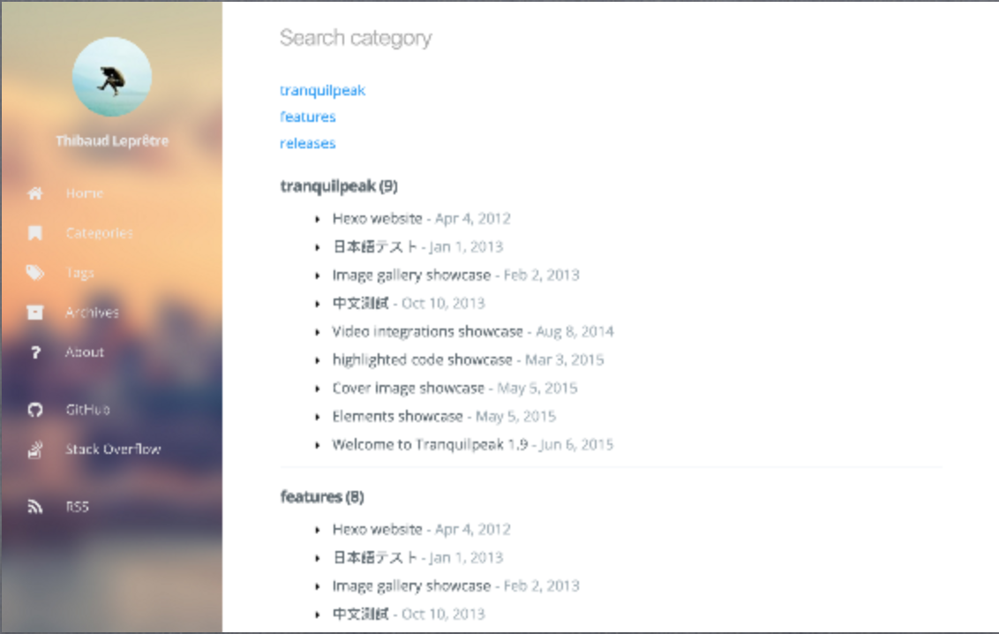

# User documentation

A gorgeous responsive theme for Hugo blog framework

[](https://tranquilpeak.kakawait.com)

Tranquilpeak theme is compatible with Hugo `v0.53`.

This documentation will help you to install hugo-tranquilpeak-theme and configure it to use all features which it provides.

If you want to report a bug or ask a question, [create an issue](https://github.com/kakawait/hugo-tranquilpeak-theme/issues/new).

## Summary

- [General](#general)
- [Features](#features)
    * [Missing features from original *Hexo* version](#missing-features-from-original-hexo-version)
- [Requirements](#requirements)
- [Installation](#installation)
- [Tranquilpeak configuration](#tranquilpeak-configuration)
    - [Language configuration](#language-configuration)
        * [Menu translation](#menu-translation)
    - [Theme configuration](#theme-configuration)
        * [Define date format](#define-date-format)
        * [Define global keywords](#define-global-keywords)
        * [Sidebar](#sidebar)
        * [Header](#header)
        * [Author](#author)
        * [Customization](#customization)
        * [Integrated services](#integrated-services)
        * [Sharing options](#sharing-options)
        * [Enable pages](#enable-pages)
- [Integrated services configuration](#integrated-services-configuration)
    * [Google Analytics](#google-analytics)
        * [Exclude hostname (localhost) while writing articles](#exclude-hostname-localhost-while-writing-articles)
    * [Social cards](#social-cards)
- [Quick & easy modifications](#quick--easy-modifications)
    * [Prerequisites](#prerequisites)
    * [Change global style](#change-global-style)
    * [Change code coloration (Highlight.js theme)](#change-code-coloration-highlightjs-theme)
- [Writing posts](#writing-posts)
    * [Front-matter settings](#front-matter-settings)
    * [Define post excerpt](#define-post-excerpt)
    * [Display table of contents](#display-table-of-contents)
    * [Tags](#tags)
        * [Alert](#alert)
        * [Highlight text](#highlight-text)
        * [Image](#image)
        * [Tabbed code block](#tabbed-code-block)
        * [Wide image](#wide-image)
        * [Fancybox](#fancybox)
- [Writing pages](#writing-pages)
- [Running](#running)

## General

- **Authors**: [Louis Barranqueiro (LouisBarranqueiro)](https://github.com/LouisBarranqueiro) and [Thibaud Leprêtre (kakawait)](https://github.com/kakawait)
- **Version**: 0.4.7-BETA (based on Hexo version 1.10.0)
- **Compatibility**: Hugo v0.53

## Features

**General features:**

- Fully responsive
- Optimized for tablets & mobiles
- Configurable menu of the sidebar
- Pages to filter tags, categories and archives
- Background cover image
- Beautiful about page
- Support Open Graph protocol
- Easily customizable (fonts, colors, layout elements, code coloration, etc..)
- Support internationalization (i18)

**Posts features:**

- Thumbnail image
- Cover image
- Responsive videos & images
- Sharing options
- Navigation menu
- GitHub theme for code highlighting (customizable)
- Image gallery
- Tags for images (FancyBox), wide images, tabbed code blocks, highlighted text, alerts
- Table of contents

**Integrated services:**

- Disqus
- Google analytics
- Gravatar
- Facebook Insights

### Missing features from original *Hexo* version

- [ ] Baidu analytics
- [ ] Algolia (https://github.com/kakawait/hugo-tranquilpeak-theme/issues/8)
- [ ] Pagination custumization `tagPagination`, `categoryPagination` and `archivePagination` (https://github.com/kakawait/hugo-tranquilpeak-theme/issues/17)

**ATTENTION** following features will not be possible due to *Hugo* limitations

- Archives pages by years `/archives/2015`
- Archives pages by month `/archives/2015/01`

## Requirements

1. **Hugo** : `v0.53`

## Installation

1. Simply clone the repository `git clone https://github.com/kakawait/hugo-tranquilpeak-theme.git` on `themes` folder
2. Rename the folder in `hugo-tranquilpeak-theme` (if necessary) and place it in `themes` folder of your Hugo blog

```shell
mkdir themes
cd themes
git clone https://github.com/kakawait/hugo-tranquilpeak-theme.git
```

## Tranquilpeak configuration

If it's your first time using Hugo, please check [Hugo official documentation](https://gohugo.io/overview/introduction/)

### Language configuration

Simply edit following value in `config.{toml,yaml,json}`:

```toml
defaultContentLanguage = "en-us"
```

by one of the following code (code is between `()`):

- Chinese (`zh-cn`)
- Chinese Traditional (`zh-tw`)
- English (`en-us`)
- Deutsch (`de-de`)
- French (`fr-fr`)
- Japanase (`ja`)
- Portuguese (`pt-br`)
- Russian (`ru`)
- Spanish (`es`)
- Vietnamese (`vi`)

If your language is not available, follow this guidelines (E.g : add swedish language (`sv-se`)) :

1. Set `defaultContentLanguage` to `sv-se` in Hugo configuration file `config.{toml,yaml,json}`
2. Create `sv-se.yaml` file in `theme/tranquilpeak/i18n/` folder
3. Copy the content of `theme/tranquilpeak/i18n/en-us.yaml` and paste it to `sv-se.yml` file
4. Replace all strings in english by their translation in swedish

#### Menu translation

Menus are defined using Hugo menus https://gohugo.io/extras/menus/

You can translate menu entries by setting `identifier` that matches a translation key. By using this way, `name` will not be use at all.

### Setting up default theme to Tranquilpeak

Modify the theme in `config.{toml,yml,json}` by changing `theme` variable to `tranquilpeak`

### Define date format

By default date will be printed like following: `mmmm d, yyyy`, example: "January 2, 2006"

You can customize it by setting

```toml
[params]
  dateFormat = "2 January 2006"
```

Will produce: "2 January 2006"

ATTENTION: date format should respect `go` `Time` package syntax, please refer to https://golang.org/pkg/time/

**Moreover, if you are using fully named month (short named month like "jan", "feb", etc is not supported), month will be translated.**

Example:

```toml
defaultContentLanguage = "fr-fr"
```

"21 July 2006" will be output "21 Juillet 2006".

### Define global keywords

You can define keywords for search engines. These keywords will be added on all pages.

```toml
[params]
  keywords = ["development", "next-gen"]
```

### Theme configuration ###

Backup your configuration:

```bash
cp config.{toml,yml,json} config.{toml,yml,json}.backup
```

Copy example configuration

```bash
cp themes/tranquilpeak/exampleSite/config.toml .
```

Complete `config.toml` with your information. Read above sections to have more information.

#### Sidebar

The sidebar is powerful and easily configurable.
You can add groups of links and links much as you want.

```toml
[[menu.main]]
  weight = 0
  identifier = "home"
  name = "Home"
  pre = "<i class=\"sidebar-button-icon fa fa-lg fa-home\"></i>"
  url = "/"
[[menu.main]]
  weight = 1
  identifier = "categories"
  name = "Categories"
  pre = "<i class=\"sidebar-button-icon fa fa-lg fa-bookmark\"></i>"
  url = "/categories"
[[menu.main]]
  weight = 2
  identifier = "tags"
  name = "Tags"
  pre = "<i class=\"sidebar-button-icon fa fa-lg fa-tags\"></i>"
  url = "/tags"
[[menu.main]]
  weight = 3
  identifier = "archives"
  name = "Archives"
  pre = "<i class=\"sidebar-button-icon fa fa-lg fa-archive\"></i>"
  url = "/archives"
[[menu.main]]
  weight = 4
  identifier = "search"
  name = "Search"
  pre = "<i class=\"sidebar-button-icon fa fa-lg fa-search\"></i>"
  url = "/#search"
  class = "st-search-show-outputs"
[[menu.main]]
  weight = 4
  identifier = "about"
  name = "About"
  pre = "<i class=\"sidebar-button-icon fa fa-lg fa-question\"></i>"
  url = "/#about"

[[menu.links]]
  weight = 0
  identifier = "github"
  name = "GitHub"
  pre = "<i class=\"sidebar-button-icon fa fa-lg fa-github\"></i>"
  url = "https://github.com/kakawait"
[[menu.links]]
  weight = 1
  identifier = "stackoverflow"
  name = "Stack Overflow"
  pre = "<i class=\"sidebar-button-icon fa fa-lg fa-stack-overflow\"></i>"
  url = "https://stackoverflow.com/users/636472/kakawait"

[[menu.misc]]
  weight = 0
  identifier = "rss"
  name = "RSS"
  pre = "<i class=\"sidebar-button-icon fa fa-lg fa-rss\"></i>"
  url = "/index.xml"
```

| Variable   | Description                           | Type          |
|------------|---------------------------------------|---------------|
| weight     | menu is ordered by weight             | int           |
| identifier | unique identifier for entry           | string        |
| name       | title to be display                   | string        |
| pre        | icon to be display a left of the name | template.HTML |
| url        | menu entry url                        | string        |
| class      | CSS Class added to the `a` link tag   | string        |

`identifier` can be use for translation see [Menu translation](#menu-translation).

#### Header

The right link of the header is customizable. You can add a link (as an icon) at the right of the header instead of the author's gravatar image or author's picture. By default, author's gravatar or author's picture is displayed.

E.g to display a shortcut to open algolia search window :

```toml
[params.header.rightLink]
  class = "open-algolia-search"
  icon = "search"
  url = "/#search"
```

|Variable|Description|
|---|---|
|url|URL of the link. If the URL is internal, domain name is not necessary|
|icon|Name of the font awesome icon class without the `fa-` (Go to [font-awesome icons](http://fontawesome.io/icons/) to find class name of icon)|
|class|CSS Class added to the link|

#### Author

```toml
[author]
  name = "Thibaud Leprêtre"
  bio = "Super bio with markdown support **COOL**"
  job = "Java backend developer"
  location = "France"
  # Your Gravatar email. Overwrite `author.picture` everywhere in the blog
  gravatarEmail = "thibaud.lepretre@gmail.com"
  # Your profile picture
  # Overwritten by your gravatar image if `author.gravatarEmail` is filled
  picture = "https://cdn1.iconfinder.com/data/icons/ninja-things-1/1772/ninja-simple-512.png"
  # Your Twitter username without the @. E.g : tranquilpeak
  twitter = "thibaudlepretre"
  # Your google plus profile id. E.g : +ThibaudLepretre or 114625208755123718311
  googlePlus = "+ThibaudLepretre"
```

| Variable        | Description                                                                          |
|-----------------|--------------------------------------------------------------------------------------|
| name            | Your name                                                                            |
| gravatarEmail   | This address will be used to get your gravatar image if you activate gravatar option |
| bio             | Your biography (Markdown and HTML supported)                                         |
| job             | Your job                                                                             |
| location        | Your location                                                                        |
| picture         | Your profile picture. Overwritten by your gravatar image if gravatar email is filled |
| twitter         | Your Twitter username without the @. E.g : `thibaudlepretre`                         |
| googlePlus      | Your google plus profile id. E.g : `+ThibaudLepretre` or `114625208755123718311`     |

#### Customization

**ATTENTION** not all customizations are documented here, you may checkout [sample config.toml](https://github.com/kakawait/hugo-tranquilpeak-theme/blob/master/exampleSite/config.toml).

```toml
[params]
  sidebarBehavior = 1
  thumbnailImage = true
  thumbnailImagePosition = "right"
  autoThumbnailImage = true
  coverImage = "images/cover.jpg"
  favicon = /favicon.png
  imageGallery = true
  hierarchicalCategories = true
  syntaxHighlighter = 'highlight.js'
```

| Variable | Description |
|--------------------------|----------------------------------------------------------------------------------------------------------------------------------------------------------------------------------------------------------------------------------------------------------------------------------------------------------------------------------------------------------------------------------------------------------------------------------------------------------------------------------------------------------------------------------------------------------------------------------------------------------------------------------------------------------------------------------------------------------------------------------------------------------------------------------------------------------------------------------------------------------------------------------------------------------------------------------------------------------------------------------------------------------------------------|
| sidebarBehavior | Define the behavior of the header and sidebar :<ul><li>1: Display extra large sidebar on extra large screen, large sidebar on large screen, medium sidebar on medium screen and header bar on small screen and extra large sidebar is swiped on extra large screen and large sidebar on all lower screens when open button is clicked (default)</li><li>2: Display large sidebar on extra large & large screen, medium sidebar on medium screen and header bar on small screen and large sidebar is swiped when open button is clicked</li><li>3: Display medium sidebar on large and medium screen and header bar on small screen and medium sidebar is swiped when open button is clicked</li><li>4: Display header bar on all screens, extra large sidebar is swiped on extra large screen and large sidebar is swiped on all lower screens</li><li>5: Display header bar on all screens and large sidebar is swiped on large screen</li><li>6: Display header bar on all screens and medium sidebar is swiped</li></ul> |
| clearReading | Hide sidebar on all article page to let article take full width to improve reading, and enjoy wide images and cover images. Useless if `sidebarBehavior` is equal to `3` or `4`. (true: enable, false: disable). Default behavior : `params.clearReading` value in theme configuration file. |
| thumbnailImage | Display thumbnail image of each post on index pages |
| thumbnailImagePosition | Display thumbnail image at the right of title in index pages (`right`, `left` or `bottom`). Set this value to `right` if you have old posts to keep the old style on them and define `thumbnailImagePosition` on a post to overwrite this setting. (Default: `right`) |
| autoThumbnailImage | Automatically select the cover image or the first photo from the gallery of a post if there is no thumbnail image as the thumbnail image. Set this value to `true` if you have old posts that use the cover image or the first photo as the thumbnail image and set `autoThumbnailImage` to `false` on a post to overwrite this setting. (Default : `true`) |
| coverImage | Your blog cover picture. **I STRONGLY recommend you to use a CDN to speed up loading of pages. There is many free CDN like Cloudinary or you can also use indirectly by using services like Google Photos.** |
| favicon | Your favicon path (Default: `/favicon.png`) |
| imageGallery | Display an image gallery at the end of a post which have `photos` variables. (false: disabled, true: enabled) |
| hierarchicalCategories | Define categories will create hierarchy between parents: `categories = ["foo", "bar"]` will consider "bar" a sub-category of "foo". If false it will flat categories. |
| customCSS (_DEPRECATED see [Add custom JS or CSS using configuration](#add-custom-js-or-css-using-configuration)_) | Define files with css that override or extend the theme css: `customCSS` = ["css/mystyles.css"]. |
| customJS (_DEPRECATED see [Add custom JS or CSS using configuration](#add-custom-js-or-css-using-configuration)_) | Define files with js that override or extend the theme js: `customJS` = ["js/myscripts.js"]. |
| syntaxHighlighter | Define which syntax highlighter you want to use (if not set syntax highlighting is disable) between `highlight.js` and `prism.js` |

E.g :
A category page look like this with `hierarchicalCategories = true` :


The same page with `hierarchicalCategories = false`:


##### Add custom JS or CSS using configuration

If you need to add some additionnal javascript or css files to your blog without forking or overriding theme itself you could use following configuration:

```toml
[params]
  [[params.customJS]]
    src = "https://cdnjs.cloudflare.com/ajax/libs/highlight.js/9.8.0/languages/go.min.js"
    integrity = "sha256-LVuWfOU0rWFMCJNl1xb3K2HSWfxtK4IPbqEerP1P83M="
    crossorigin = "anonymous"
    async = true
    defer = true

  [[params.customJS]]
    src = "https://cdnjs.cloudflare.com/ajax/libs/highlight.js/9.8.0/languages/dockerfile.min.js"
    integrity = "sha256-putofyQv7OB569xAldpyBnHJ0Uc+7VGp5Us05IgDGss="
    crossorigin = "anonymous"
    async = true
    defer = true

  [[params.customJS]]
    src = "js/myscript.js"

  [[params.customCSS]]
    href = "css/mystyle.css"
```

**ATTENTION** there is no limitation on key structures and each keys will be converted as tag attributes.

Futhermore, even if previous syntax is still supported (`customJS = ["js/myscripts.js"]`), you can't mix both new and old syntax.

#### Integrated services

```toml
disqusShortname =
googleAnalytics =
```

```toml
[author]
  gravatarEmail =
```

```toml
[params]
  fbAdminIds =
  fbAppId =
```

| Variable | Description |
|---------------------|---------------------------------------------------------------------------------------------------------------------------------------------------------------------------------------------------------------------------------------------------------------------|
| disqusShortname | Your Disqus shortname. |
| gravatarEmail | Your gravatar email. Overwrite `author.picture` everywhere in the blog |
| googleAnalytics | Your Google analystics web property ID : UA-XXXXX-X |
| fbAdminIds | Your Facebook user ids used to connect your blog with your facebook user accounts (Facebook Insights). Use array syntax. E.g : `[9830047, 1003342]`. Visit [Facebook docs](https://developers.facebook.com/docs/platforminsights/domains) for more information. |
| fbAppId | Your Facebook app id used to connect your blog with your facebook app account (Facebook Insights). E.g : `9841307`. Visit [Facebook docs](https://developers.facebook.com/docs/platforminsights/domains) for more information. |

#### Sharing options

``` toml
[params]
  [[params.sharingOptions]]
    name = "Facebook"
    icon = "fa-facebook-official"
    url = "https://www.facebook.com/sharer/sharer.php?u=%s"

  [[params.sharingOptions]]
    name = "Twitter"
    icon = "fa-twitter"
    url = "https://twitter.com/intent/tweet?text=%s"

  [[params.sharingOptions]]
    name = "Google+"
    icon = "fa-google-plus"
    url = "https://plus.google.com/share?url=%s"
```

You can comment and uncomment to enable or disable sharing options. If your own sharing options, simply add new sharing options on your configuration. E.g with **foo_bar** social network:

```toml
[params]
  [[params.sharingOptions]]
    name = "Foo bar"
    icon = "fa-foo-bar"
    url = "https://www.foo-bar.com/sharer/sharer.php?u=%s"
```

|Variable|Description|
|---|---|
|name| Name of your sharing site.|
|icon|Name of the fontawesome icon class (Go to [font-awesome icons](http://fontawesome.io/icons/) to find class name of icon)|
|url|URL of the link. use %s to specify where to put the permalink.|

#### Enable pages

Tranquilpeak provides you 2 pages to display all posts title and date by tags, by categories, by date and an about page. To enable one of this pages simply add following [taxonomies](https://gohugo.io/taxonomies/overview/):

```toml
[taxonomies]
  tag = "tags"
  category = "categories"
```

## Integrated services configuration

### Google Analytics

#### Exclude hostname (localhost) while writing articles

While you are writing articles, you need to check the result a lot of times before deploying your site.
If you have enable Google analytics service, Google will include all requests done, even when hostname is localhost and this can greatly skew the results.
To overcome this, you have to add a filter on Google Analytics website.

Follow these steps, to add new filter :

1. Sign in to your Google Analytics account
2. Select the **Admin** tab and navigate to the **property** in which you want to create the filter **(Account > Property > View)**
3. In **View** column, click on **Filters** button
4. Click on **+ NEW FILTER** button
6. Enter a name for the filter
7. Select **Custom filter**, **Filter Field** : `Hostname`, **Filter Pattern** :  `(.*?localhost.*?)`
8. Click on **Save** button

### Social cards

You can configure how links to your site will appear in Twitter and/or Facebook. There are several ways of setting up card parameters:

* **Title**: if in a page with title (like a post) it will use post title, otherwise, will use site title.
* **Description**: will use article summary, if it does not exist, will use site description.
* **Site author** (twitter only): will use the value of `twitter` field on ``[[params.Author]]`` section of your `config.toml` file.
* **Content author** (twitter only): will use the value of the field `twitter` in your document header. If not specified, will use the **Site author** field value.
* **Image**: will use the following fields in order, if one is not available, the next will be taken: thumbnail of document, cover of document, gallery images, gravatar email then author picture, .

## Quick & easy modifications

### Prerequisites

Since you are going to edit the theme, you have to install all the necessary to build it after changes : [Installation](https://github.com/kakawait/hugo-tranquilpeak-theme/blob/master/docs/developer.md#installation)

**Run command in theme folder : `hexo-blog/themes/tranquilpeak`**

### Change global style

If you want to change font families, font size, sidebar color, things like that, take a look at `source/scss/utils/_variables.scss` file. This file contains global variables used in this theme. **Build the theme after changes to see changes.**

### Change code coloration (Highlight.js theme)

Tranquilpeak integrate its own highlight.js theme inspired by GitHub.
Of course, you can replace it with an other theme found on highlight.js repository. Since Hexo use different CSS class names, all theme are not ready out of the box, but it is very easy to make them compatible.

Follow these steps :

1. Get your theme here : [Highlight.js theme](https://github.com/isagalaev/highlight.js/tree/master/src/styles) or create yours
2. Follow guidelines in `src/scss/themes/hljs-custom.scss` file
3. Build the theme with `npm run prod`. Learn more about Grunt tasks : [Grunt tasks](https://github.com/LouisBarranqueiro/hexo-theme-tranquilpeak/blob/master/docs/developer.md#grunt-tasks)

## Writing posts

To write articles, you have to use Markdown language. [Here](https://guides.github.com/features/mastering-markdown/#examples) you can find the main basics of Markdown syntax.
Please note, there are many different versions of Markdown and some of them are not supported by Hugo.

**I STRONGLY recommend you to use a CDN to speed up loading of pages. There is many free CDN like Cloudinary or you can also use indirectly by using services like Google Photos.**

### Front-matter settings

Tranquilpeak introduces new variables to give you a lot of possibilities.

Example :

```markdown
disqusIdentifier: fdsF34ff34
keywords:
- javascript
- hexo
clearReading: true
thumbnailImage: image-1.png
thumbnailImagePosition: bottom
autoThumbnailImage: yes
metaAlignment: center
coverImage: image-2.png
coverCaption: "A beautiful sunrise"
coverMeta: out
coverSize: full
coverImage: image-2.png
gallery:
    - image-3.jpg "New York"
    - image-4.png "Paris"
    - http://i.imgur.com/o9r19kD.jpg "Dubai"
    - https://example.com/orignal.jpg https://example.com/thumbnail.jpg "Sidney"
comments: false
showTags: true
showPagination: true
showSocial: true
showDate: true
summary: "This is a custom summary and does *not* appear in the post."
```

|Variable|Description|
|---|---|
|disqusIdentifier|Define a unique string which is used to look up a page's thread in the Disqus system.|
|keywords|Define keywords for search engines. you can also define global keywords in Hugo configuration file.|
|clearReading|Hide sidebar on all article page to let article take full width to improve reading, and enjoy wide images and cover images. Useless if `params.sidebarBehavior` is equal to `3` or `4`. (true: enable, false: disable). Default behavior : `params.clearReading` value in theme configuration file.|
|autoThumbnailImage|Automatically select the cover image or the first photo from the gallery of a post if there is no thumbnail image as the thumbnail image. `autoThumbnailImage` overwrite the setting `autoThumbnailImage` in the theme configuration file|
|thumbnailImage|Image displayed in index view.|
|thumbnailImagePosition|Display thumbnail image at the right of title in index pages (`right`, `left` or `bottom`). `thumbnailImagePosition` overwrite the setting `thumbnailImagePosition` in the theme configuration file|
|metaAlignment|Meta (title, date and categories) alignment (right, left or center). Default behavior : left|
|coverImage|Image displayed in full size at the top of your post in post view. If thumbnail image is not configured, cover image is also used as thumbnail image. Check the beautiful demo here : [Cover image demo](https://tranquilpeak.kakawait.com/2015/05/cover-image-showcase/)|
|coverSize|`partial`: cover image take a part of the screen height (60%), `full`: cover image take the entire screen height.|
|coverCaption|Add a caption under the cover image : [Cover caption demo](https://tranquilpeak.kakawait.com/2015/05/cover-image-showcase/)|
|coverMeta|`in`: display post meta (title, date and categories) on cover image, `out`: display meta (title, date and categories) under cover image as usual. Default behavior : `in`|
|gallery|Images displayed in an image gallery (with fancybox) at the end of the post. If thumbnail image is not configured and cover image too, the first photo is used as thumbnail image. format: `original url [thumbnail url] [caption]`, E.g : `https://example.com/original.jpg https://example.com/thumbnail.jpg "New York"`|
|comments|`true`: Show the comment of the post.|
|showDate|`true`: Show the date when `true` (default)|
|showTags|`true`: show tags of this page.|
|showPagination|`true`: show pagination.|
|showSocial|`true`: show social button such as share on Twitter, Facebook...|
|showMeta|`true`: Show post meta (date, categories).|
|showActions|`true`: Show post actions (navigation, share links).|
|summary|Custom excerpt text to show on the homepage.|

Example:
A post on index page will look like this with :`thumbnailImagePosition` set to `bottom`:


The same with : `thumbnailImagePosition` set to `right`:


The same with : `thumbnailImagePosition` set to `left`:


### Define post excerpt

Use:

- `<!--more-->` to define post excerpt and keep the post excerpt in the post content
- For a custom exerpt *not* in the post content, use the `summary` front-matter variable. Markdown syntax is supported.

### Display table of contents

As post excerpt feature enable with `<!--more-->` comment, you can display the table of contents of a post with  `<!-- toc -->`.  Place this comment where you want to display the table of content.

Here is what looks like the table of contents generated:


### Tags

Tranquilpeak introduce new tags to display alert messages, images in full width and create beautiful galleries.

#### Alert


Alert tag is useful to highlight a content like a tips or a warning. Check it live here : [Alert tag demo](https://tranquilpeak.kakawait.com/2014/10/tags-plugins-showcase/#alert)

Syntax:
```

content

```

E.g:
```

Here is a danger alert without icon

```

|Argument|Description|
|---|---|
|Classes|<ul><li>info</li><li>success</li><li>warning</li><li>danger</li><li>no-icon</li></ul>|

#### Highlight Text


Highlight text tag is useful to highlight an interesting part in a text. Check it live here : [Highlight text tag demo](https://tranquilpeak.kakawait.com/2014/10/tags-plugins-showcase/#highlight-text)

Syntax:
```

content

```

E.g:
```

your highlighted text

```

|Argument|Description|
|---|---|
|Classes|<strong>classes</strong> : <ul><li>red</li><li>green</li><li>blue</li><li>purple</li><li>orange</li><li>yellow</li><li>cyan</li><li>primary</li><li>success</li><li>warning</li><li>danger</li></ul>|

**It's important to put the paragraph that contains highlight text tag inside** `<p>...</p>`
**otherwise the following content may not be rendered.**

#### Image

Image tag is useful to add images and create beautiful galleries. Check what are the possibilities here : [Image tag demo](https://tranquilpeak.kakawait.com/2014/10/tags-plugins-showcase/#image)

Syntax:
```

```

E.g:
```

```

|Argument|Description|
|---|---|
|classes (optional)|You can add css classes to stylize the image. Separate class with whitespace. Tranquilpeak integrate many css class to create nice effects :  <ul><li><strong>fancybox</strong> : Generate a fancybox image.</li><li><strong>nocaption</strong> : Caption of the image will not be displayed.</li><li><strong>left</strong> : Image will float at the left.</li><li><strong>right</strong> : Image will float at the right.</li><li><strong>center</strong> : Image will be at center.</li><li><strong>fig-20</strong> : Image will take 20% of the width of post width and automatically float at left.</li><li><strong>fig-25</strong> : Image will take 25% of the width of post width and automatically float at left.</li><li><strong>fig-33</strong> : Image will take 33% of the width of post width and automatically float at left.</li><li><strong>fig-50</strong> : Image will take 50% of the width of post width and automatically float at left.</li><li><strong>fig-75</strong> : Image will take 75% of the width of post width and automatically float at left.</li><li><strong>fig-100</strong> : Image will take 100% of the width of post width.</li><li><strong>clear</strong> : Add a div with `clear:both;` style attached after the image to retrieve the normal flow of the post.</li></ul>|
|group (optional)| Name of a group, used to create a gallery. **Only for image with `fancybox` css class**|
|src| Path to the original image.|
|thumbnail (optional)| Path to the thumbnail image. If empty, the orignal image will be displayed.|
|thumbnail-width (optional)| Width to the thumbnail image. If the thumbnail image is empty, width will be attached to thumbnail image created from original image. E.g : `150px` or `85%`.|
|thumbnail-height (optional)| Height to the thumbnail image. If the thumbnail image is empty, height will be attached to thumbnail image created from original image. E.g : `300px` or `20%`.|
|title (optional)| Title of image displayed in a caption under image. `Alt` HTML attribute will use this title. E.g : `"A beautiful sunrise"`.|

#### Tabbed code block

Tabbed code blocks are useful to group multiple code blocks related. For example, the source code of a web component (html, css and js). Or compare a source code in different languages.


Check it live : [tabbed code block demo](https://tranquilpeak.kakawait.com/2014/10/tags-plugins-showcase/#tabbed-code-block)

Syntax:
``` js

    <!-- tab [lang] -->
        source code
    <!-- endtab -->

```

E.g:
``` js

    <!-- tab js -->
        var test = 'test';
    <!-- endtab -->
    <!-- tab css -->
        .btn {
            color: red;
        }
    <!-- endtab -->

```
|Argument|Description|
|---|---|
|Name (optional)|Name of the code block, or of the file|
|Link (optional)|Link to a demo, or a file|
|Lang (optional)|Programming language use for the current tab|

#### Wide image

Wide image tag is useful to display wide images in full width. It take the entire window width. Check the the result : [Wide image tag demo](https://tranquilpeak.kakawait.com/2014/10/tags-plugins-showcase/#wide-image)

Syntax:
```

```

E.g:
```

```

|Argument|Description|
|---|---|
|src|Path to the original image.|
|title (optional)|Title of image displayed in a caption under image. `Alt` HTML attribute will use this title. E.g : `"A beautiful sunrise"`.|


## Writing pages ##

Sometimes you need to create a **page** that is **not** a **regular blog post**,
where you want to hide the date, social sharing buttons, tags, categories
and pagination.
This is the case for the blog pages _About_ or _Contact_ for instance which do
not need to be timestamped (nor tagged or categorized) nor provide
pagination and are not intended to be shared on social networks.

In order to create such a page you can proceed like so:

```
hugo new page/contact.md
```

This creates the file `contact.md` in the directory `content/page`
pre-populated with the following front matter.

```yaml
---
title: "New Page"
categories:
- category
- subcategory
tags:
- tag1
- tag2
keywords:
- tech
comments:       false
showMeta:       false
showActions:    false
#thumbnailImage: //example.com/image.jpg
---

```

The rest is basically the same as for a regular _[post](#writing-posts)_.

## Running ##

Run `hugo server` and start writing! :)
